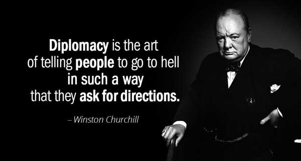

Many people ask me how to communicate in a nice, polite, and professional manner when the situation or circumstances are not pleasant or comfortable.

Have you ever wanted to tell a coworker that it is his or her problem, not yours? To inform your project manager that you are wasting your time in meetings? To tell your boss that his brilliant idea is a disaster?

Not to worry, I have compiled a list of 50 questions and answers to help you deal with these situations professionally.

## 1. Why would I go into the office when I can do my job from home?

Can you explain why I am required to be in the office when I can carry out my job responsibilities effectively remotely?

## 2. Leave me alone and let me do my job.

It would be greatly appreciated if you could give me some breathing room to finish my work.

## 3. If you expect me to do the job of 3 people then I expect you to pay me the salary of 3 people.

Are new team members being brought in to fill these roles, or will I be expected to take on these responsibilities? If this is the case, I would be delighted to schedule a meeting to discuss appropriate compensation for this role expansion.

## 4. You are not my boss, stop assigning me work.

Have you spoken with [insert manager's name] about me taking this on? I have not been informed that I will be working on this.

## 5. So you expect me to take on more work but pay me the same?

Is the expectation here that my responsibilities and workload are evolving but I remain with the same job title and compensation?

## 6. Google that for yourself!

The internet is a great resource for these types of questions and I am available to clarify elements that you are not able to find online

## 7. That's not part of my job.

I am not the right person to help you with this, but I am happy to connect you with [insert name] who can.

## 8. You are wasting my time.

Respecting everyone's time, let's reconvene when more information becomes available.

## 9. I am not a mind reader, how am I supposed to know that?

This was not communicated to me before this.

## 10. Why didn't you tell me that the first time?

It would have been beneficial to communicate about this earlier in the process.

## 11. These meetings are unnecessary.

Being respectful of everyone’s time, can we communicate about this via email forward?

## 12. If you want it done your way then just do it yourself.

Because you appear to have a very clear vision for how to carry this out, I encourage you to take the lead here, and I am happy to assist you as needed.

## 13. I have told you this 100 times.

The information has not changed since the last time it was communicated.

## 14. I don't want to work with you more than I have to.

Would you be willing to replace our frequent communications with a monthly check-in during which we can discuss all updates?

## 15. I don't want to attend a work event during my personal time.

I am unable to attend after working hours.

## 16. If I am doing your job for you, then what are you doing all day?

Is there a higher priority task that is consuming all of your capacity at the moment?

## 17. I can't take on any more work right now.

I am currently unable to take on that task due to my current workload. Is there anyone else who can help with this?

## 18. Your micromanaging isn't making this go any faster.

Though I appreciate your attention to this, I believe I could be more productive if I could work independently here.

## 19. Does taking on all this extra work come with extra pay?

Is there a plan to review my title and compensation as my role evolves to better reflect these new responsibilities?

## 20. Stop promising unrealistic timelines!

Can you walk me through your thought process on these timelines? I have some reservations about the dates provided.

## 21. If you have me scheduled in the meetings all day, when do you expect me to get this work done?

My calendar is currently jam-packed with meetings. To make sure I have enough time to complete this, I can skip lower-priority meetings this week or extend the deadline on this project. Please let me know which one you prefer.

## 22. Are you gonna do your job or am I going to have to do it for you?

If you require my support to complete this task please let me know.

## 23. Stop following up every 20 minutes. I will get back to you when I can.

I would appreciate your patience as I need time to address this. I will provide an update as soon as one is available.

## 24. Read the whole email before you respond.

The previous communications contain the information you are looking for.

## 25. That's not my problem.

What you are describing is not something within my control.

## 26. You should be the one doing this, not me.

This is, as far as I can tell, your responsibility. Please let me know if this is not the case.

## 27. I don't need to be included in this.

I do not feel as though I can add value to this conversation. Please remove me from this thread and feel free to loop me back in the future should my involvement be required.

## 28. Can you be more clear about what you want?

To successfully complete this I will need further details on what is required.

## 29. Try problem-solving on your own before you come to me.

I encourage you to brainstorm possible solutions before looping me in for additional support.

## 30. I told you so and now this is your problem.

I did previously note that this was a likely outcome. How do you plan to resolve this?

## 31. Our deadline is approaching. Hurry up!

As our deadline is quickly approaching, can you provide an update as to where you are in completing this task?

## 32. Stop trying to make me do your work!

I am not able to offer you additional support in completing your workload as I'm at capacity with my own assigned responsibilities.

## 33. Stop interrupting me!

Thank you for your input [insert name], but please wait until I am finished sharing my thoughts before proceeding.

## 34. Stop ignoring my meeting requests!

Your attendance is required for this discussion. If this date/time does not work on your end please propose a new time that works for you.

## 35. I am not working today. Why are you calling me?

If you are off, just don't answer.

## 36. Check your inbox, I already sent this to you.

I previously sent you an email regarding that but please let me know if something went wrong in transit.

## 37. I couldn't care less.

I will defer to your judgment on this as I am not passionate either way and I trust your expertise.

## 38. Stop ignoring my emails!

I understand this is a busy time and if it's easier for you to jump on a call I am happy to set up some time to get this resolved.

## 39. Stop disrespecting me!

Our effectiveness would benefit from a greater level of respect and professionalism than what I currently feel is being displayed.

## 40. I totally forgot about your email.

Thank you for your patience.

## 41. I am gonna need a lot more detail if you want me to do this.

Please let me know when further details become available as I require more information to successfully complete this task.

## 42. Stop trying to call me before my work day even starts!

If you need to contact me, please note that my working hours begin at 8 am and communications received before this will not be seen.

## 43. We do not need to have a meeting about this.

Being respectful of everyone's time let's discuss this through email until we have a more defined agenda.

## 44. Did you just take credit for my work?

It is great to see my ideas being exposed to a broader audience and I would have appreciated the opportunity to have been included in the delivery.

## 45. I don't believe you.

I'm not convinced that the information you've provided is accurate.

## 46. What you are saying does not make sense.

We seem to have a different understanding of this. Can you elaborate further on your thought process here?

## 47. That sounds like a horrible idea.

Are we confident that this is the best solution or are we still exploring alternatives?

## 48. Stop excluding me from important meetings

Please include me in future meetings related to this topic, as my involvement is necessary

## 49. Why didn't you ask me for this sooner?

Given the tight turnaround, it would have been beneficial to have me looped in sooner.

## 50. Stop emailing me so often!

To ensure the information does not get lost, let's reduce the frequency of communication, so updates are only provided once more details have been established.

## Conclusion

I will conclude this blog post with one of my favorite quotes: 

> Credits to [Laura](https://direct.me/loewhaley) 
