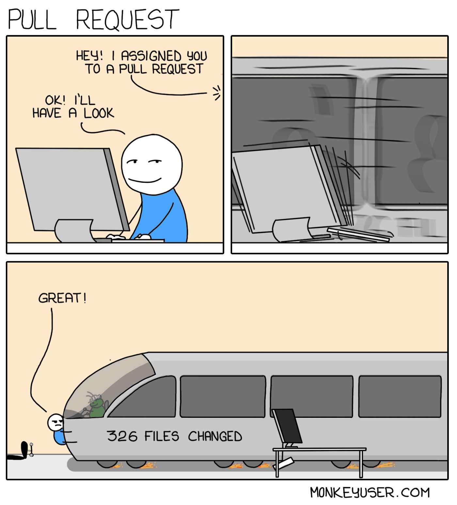

When done correctly, code reviews can be a great way to prevent bugs, improve code quality, and spread business and technical knowledge through the development team. 

Code review is a skill that takes time to learn from both perspectives, reviewing the code and creating reviewable code. However, code reviews can be a big headache for reviewers, congested road to delivery, and excellent time-wasting element when done incorrectly.

If you want to make your colleagues hate you, make sure you do the following steps.

## 1. Request changes that will have no effect

To succeed in this step, you must first learn your company's code style guide. This allows you to begin requesting code style changes that are not explicitly mentioned in the style guide. If your company doesn't have a code style guide, that's even better because it allows you to grind your coworkers even more.

For example, if your colleague names a variable, function, or class in an overly detailed and verbose manner, leave a comment requesting that they change the naming to something less verbose.

Is their code too elegant? Make sure to piss on their code as much as they did on yours. Say something about making junior developers' lives easier, make them write meaningless comments, or even better, refactor their code.

Why are variables not declared alphabetically? That is not an option. Make a change!

Do they include an extra empty line? Request a change right away so they have to change it!

Please DO NOT leave comments like this:

> I propose that we use Y instead of X to achieve a shorter, more elegant, and concise solution.

This is too gentle and makes you appear too nice. Make sure your code comment is passive-aggressive. As an example:

> This is completely incorrect; why don't you just use X instead of Y?

If there are two ways to do something, insist on changing their code to do it your way. Don't be swayed by arguments such as the disadvantages of your approach or the advantages of their approach. You must take part in a 10-comment thread in which you explain why this should be changed.

## 2. Delay the code review 

When a merge request is created, you should focus on quickly finding something “smelly” in the code. so you are able to leave a comment. The most important part is now finished. Their merge request will not be merged right away.

If they are overly enthusiastic and respond to your comment within the next 10 minutes, remember that you should respond to their comments slowly. Your goal here is to make their merge request stale. Opened and stale merge requests are considered technical debt because they require time to maintain.

If your colleague created a merge request on Monday and you commented the same day (to prevent a merge request from being merged), respond to their changes within 24 hours. Delay it for at least 24-48 hours.

The ideal situation is when someone else's merge request gets merged before theirs, resulting in a merge conflict. This is an excellent opportunity to refuse to do a code review until the merge conflict is resolved. Why would you waste time reviewing code that may be changed once the merge conflict is resolved?

Before their merge request is merged, they should receive at least 2-3 merge conflicts in code review iterations. If they are able to merge their code with no merge conflicts, you are responding too quickly.

## 3. Hide the actual changes in the code well

Keep in mind that code review is a two-player game. They will also look over your code. 

You must confuse your opponent and test their nerves as well as their ability to observe the code in these situations. Don't even consider adding a description to your merge request. They must make an effort to learn about your code.

Additional refactorings, code style changes, and actual code changes should be included in every merge request you create. So, if your merge request contains 20 lines of code with actual changes, you should include 50% more code to confuse your opponent.

The best outcome here is to create a perfect cover for the actual code change in the merge request so that they approve it blindly.

## 4. Make massive merge requests

When a merge request contains 10-20 lines of code, it is simple to review the code. However, this is not what you are looking for.

Every merge request should have at least 1000 lines of code spread across 10-15 files, according to the rule of thumb. This will stun your opponent, causing them to waste time on review and gradually lose motivation to do proper code review.

Make sure to ping your reviewers on [Slack](https://mensurdurakovic.com/blog/slack-bon-ton/) frequently to put pressure on them to approve your merge request as soon as possible.

Remind them that your merge requests are more important than theirs and that you do not want to incur technical debt while waiting for approval.

## 5. Ignore their suggestions and comments

Your adversaries will eventually leave comments on your merge request. Because, as the saying goes, "you pissed on my code yesterday, I'll piss on yours today."

Ignoring this situation is the best way to deal with it [(ostrich effect)](https://mensurdurakovic.com/blog/the-most-common-laws-and-principles-in-software-development/).

Do they provide feedback on your code? Go get your buddy to approve your merge request so that you can merge it without interfering with their comments.

You should not be prevented from merging your merge request because some jerk decided to provide you with valid feedback on your code.

## Conclusion

Things to avoid if you want your coworkers to enjoy their work:
- Use a linter to help you automate your code style.
- Request changes only when they provide an advantage over the existing code.
- Rapidly review merge requests
- Respond to code review comments as soon as possible.
- Schedule time each day for code review.
- When requesting code changes, make sure that the changes are tested.
- Separate merge requests should be created for code cleanups.
- Make small, frequent merge requests.
- Respond to all feedback, either agreeing or giving an argument why you disagree.
