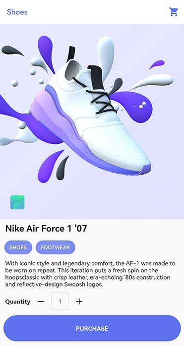
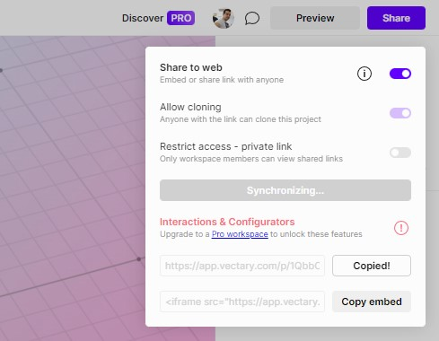
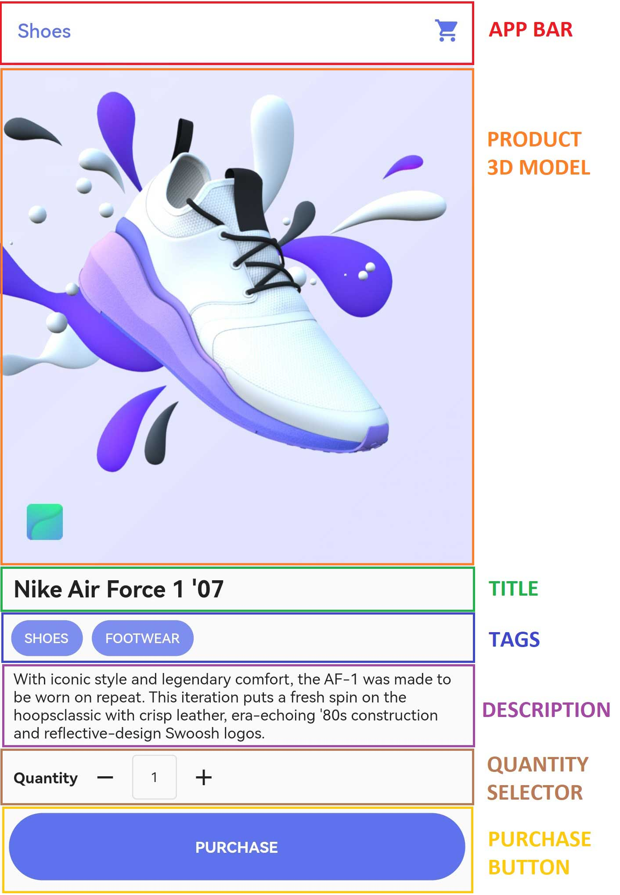

Users love attractive and cool-looking features in the applications, so today we will learn how to create a super awesome yet easy-to-implement 3D product screen in Flutter. Here is the final version of the screen that we will build:



## Requirements

Before we jump to the coding part, we will need a 3D model of our product screen. For that purpose, we will use [Vectary](https://www.vectary.com/) as it offers free-to-use 3D models. After you create a new account there, you can pick any 3D model you want but in this article, we will use a 3Dmodel for shoes. We can pretend that those are new shiny Nike shoes. With help of [Vectary](https://www.vectary.com/) users can rotate a product vertically and horizontally, and also zoom in and out. Here is a little GIF of how it looks in action:


After you are done with your registration, picked your 3D model, you can click on the share button and copy the URL to your 3D model like this:



## Widgets

Now before you start coding you should always analyze the design and visualize how you are going to dissect the design into widgets. Widgets are small reusable chunks of code, similar to components in React, Vue, or any other web framework.

Here are the widgets that we will need to build for our product screen:



## Project setup

Now we can start with our project setup. Open the command line, and hit this command to create a new flutter project:

```console
flutter create shoes_app
```

As we have a web URL for our 3D model that we need to display, we will need to install a package called [webview_flutter](https://pub.dev/packages/webview_flutter) in our project. To do so, we need to navigate inside our ```shoes_app``` project and execute this command:

```console
flutter pub add webview_flutter
```

If you try to run your project you will probably encounter some errors as ```webview_flutter``` requires ```compileSdkVersion``` to be at least 32 and ```minSdkVersion``` to be at least 19, so you can go to ```.\android\app\build.gradle``` file and change these to fix the error. The application should build successfully now.

Finally, to have a clean start, we can get rid of the starter code and make our code ```main.dart``` looks like this:


```java
import 'package:flutter/material.dart';

void main() {
  runApp(const MyApp());
}

class MyApp extends StatelessWidget {
  const MyApp({super.key});

  @override
  Widget build(BuildContext context) {
    return MaterialApp(
      debugShowCheckedModeBanner: false,
      title: "3D Shoes",
      theme: ThemeData(primarySwatch: Colors.blue),
      home: const ProductPage(),
    );
  }
}

const blue = Color(0xFF5E72ED);
const appBarTitle = "Shoes";
const productTitle = "Nike Air Force 1 '07";
const productDescription = "With iconic style and legendary comfort, "
    "the AF-1 was made to be worn on repeat. "
    "This iteration puts a fresh spin on the hoops"
    "classic with crisp leather, era-echoing '80s "
    "construction and reflective-design Swoosh logos. ";
const tags = ["SHOES", "FOOTWEAR"];
const webViewUrl = "https://app.vectary.com/p/3lYIQYLTn7AicEiVCPhReG";

class ProductPage extends StatelessWidget {
  const ProductPage({super.key});

  @override
  Widget build(BuildContext context) {
    return const Scaffold(
      body: Center(
        child: Text("Hello world!"),
      ),
    );
  }
}
```

Here we added couple of constants which we will pass down to the appropriate widgets. We also defined a blue theme for our app and a custom blue-ish color for our icons, tags, and purchase button.
As our product description string is quite large, we split the string to take less space horizontally and it's a neat trick to make your code look a bit cleaner. The string will be displayed normally in the app as this doesn't actually change it.

## App bar widget

Now we can create a new file ```app_bar.dart``` where we will create our custom app bar widget:

```java
import 'package:flutter/material.dart';

class ProductAppBar extends StatelessWidget with PreferredSizeWidget {
  final Color color;
  final String text;

  const ProductAppBar({
    Key? key,
    required this.color,
    required this.text,
  }) : super(key: key);

  @override
  Size get preferredSize => const Size.fromHeight(kToolbarHeight);

  @override
  Widget build(BuildContext context) {
    return AppBar(
      backgroundColor: Colors.white,
      elevation: 0.2,
      title: Text(
        text,
        style: TextStyle(color: color),
      ),
      actions: [
        IconButton(
          onPressed: () {},
          icon: Icon(
            Icons.shopping_cart,
            color: color,
          ),
        )
      ],
    );
  }
}

```

To make your own custom ```AppBar``` you have to add ```with``` keyword for ```PreferredSizeWidget``` mixin as you need to tell Flutter what is the height of your app bar. To do so, you must ```override``` the ```preferredSize``` getter and set height. In this example we won't change the height, so we will use the constant ```kToolbarHeight``` which is already defined in the Flutter. If you do ```cmd + click```, it will take you to the source code of ```material.dart``` and there you will see this:

```csharp
/// The height of the toolbar component of the [AppBar].
const double kToolbarHeight = 56.0;
```

Rest of the code is pretty straightforward. We pass the ```text``` parameter which will be our app bar title and ```color``` parameter which will be used for the color of the shopping cart icon on the right side of the app bar.

## ProductText widget

Now we will create a new file ```product_body.dart``` where we will have the rest of the widgets for our screen. After the widgets are finished we will just use them and return the complete product body.

Here is code for our ```ProductText``` widget:

```csharp
class ProductText extends StatelessWidget {
  final String text;
  final double fontSize;
  final FontWeight fontWeight;

  const ProductText({
    Key? key,
    this.fontSize = 16.0,
    this.fontWeight = FontWeight.normal,
    required this.text,
  }) : super(key: key);

  @override
  Widget build(BuildContext context) {
    return Padding(
      padding: const EdgeInsets.symmetric(
        horizontal: 12.0,
        vertical: 8.0,
      ),
      child: Text(
        text,
        style: TextStyle(
          fontSize: fontSize,
          fontWeight: fontWeight,
        ),
      ),
    );
  }
}
```

Nothing special here, we pass title in the text parameter and give a text a bit of breathing room with ```Padding``` widget. As we plan to use this widget for product title and product description, parameters ```fontSize``` and ```fontWeight``` are also added so that we have flexibility. By default ```fontSize``` will be 16.0 and ```fontWeight``` will be ```FontWeight.normal```.

## Tags widget

Product can have multiple tags, usually 2 or 3, so we pass a list of strings for product tags and color for the background color of those tags. This is how our ```Tags``` widget code looks like:

```csharp
class Tags extends StatelessWidget {
  final List<String> tags;
  final Color bgColor;

  const Tags({
    Key? key,
    required this.tags,
    required this.bgColor,
  }) : super(key: key);

  @override
  Widget build(BuildContext context) {
    return Padding(
      padding: const EdgeInsets.symmetric(horizontal: 10),
      child: Row(
        children: [
          ...tags.map(
            (tag) => Padding(
              padding: const EdgeInsets.only(right: 8),
              child: Chip(
                label: Text(
                  tag,
                  style: const TextStyle(color: Colors.white),
                ),
                backgroundColor: bgColor.withOpacity(0.8),
              ),
            ),
          ),
        ],
      ),
    );
  }
}
```

We use ```.map()``` function to map our tag text into ```Chip``` widget and spread operator to put those ```Chip``` widgets as a ```Row``` children. Color is also tuned down with ```.withOpacity()``` function.

## QuantitySelector widget

This one is a bit different from other widgets, as this one is ```StatefulWidget```, which means that it holds some data for us. In this case, it is a quantity that the user can increase and decrease. 

```csharp
class QuantitySelector extends StatefulWidget {
  const QuantitySelector({Key? key}) : super(key: key);

  @override
  State<QuantitySelector> createState() => _QuantitySelectorState();
}

class _QuantitySelectorState extends State<QuantitySelector> {
  int quantity = 1;

  void decreaseQuantity() {
    if (quantity > 1) {
      setState(() => quantity -= 1);
    }
  }

  void increaseQuantity() {
    setState(() => quantity += 1);
  }

  @override
  Widget build(BuildContext context) {
    return Padding(
      padding: const EdgeInsets.symmetric(horizontal: 12),
      child: Row(
        children: [
          const Text(
            "Quantity",
            style: TextStyle(
              fontSize: 16.0,
              fontWeight: FontWeight.bold,
            ),
          ),
          IconButton(
            onPressed: decreaseQuantity,
            icon: const Icon(Icons.remove),
          ),
          Container(
            width: 40.0,
            height: 40.0,
            decoration: BoxDecoration(
              borderRadius: BorderRadius.circular(4.0),
              border: Border.all(
                width: 1.0,
                color: Colors.grey.withOpacity(0.3),
              ),
            ),
            child: Center(
              child: Text(quantity.toString()),
            ),
          ),
          IconButton(
            onPressed: increaseQuantity,
            icon: const Icon(Icons.add),
          )
        ],
      ),
    );
  }
}
```

Here we are using ```Row``` widget so that we can position text "Quantity", decrease icon, current quantity value and increase icon next to each other on the X axis. 

We also have 2 ```onPressed``` event handlers ```decreaseQuantity``` and ```increaseQuantity``` which are executed when the user presses the ```IconButton```. 

In ```decreaseQuantity``` we decrease quantity by 1 each time ```IconButton``` is pressed. The limit is 1, as a user should not be allowed to go to 0 or negative values. Function ```increaseQuantity``` is doing the opposite thing, it increases the quantity value with no limits. 

Both of these function use ```setState()``` function to reflect the changes in quantity value on the UI.

## PurchaseButton widget

Purchase button is a simple widget for a user to confirm his purchase

```csharp
class PurchaseButton extends StatelessWidget {
  final Color color;
  final VoidCallback onPurchaseHandler;

  const PurchaseButton({
    required this.color,
    required this.onPurchaseHandler,
    Key? key,
  }) : super(key: key);

  @override
  Widget build(BuildContext context) {
    return Padding(
      padding: const EdgeInsets.all(8.0),
      child: InkWell(
        onTap: onPurchaseHandler,
        child: Container(
          height: 60.0,
          decoration: BoxDecoration(
            borderRadius: BorderRadius.circular(30.0),
            color: color,
          ),
          child: const Center(
            child: Text(
              "PURCHASE",
              style: TextStyle(
                color: Colors.white,
                fontWeight: FontWeight.bold,
                fontSize: 16,
              ),
            ),
          ),
        ),
      ),
    );
  }
}
```

To make a nice wide round button, here we use ```InkWell``` widget to listen for ```onTap``` events, while ```Container``` widget is used for creating border radius and background color. We also pass reference to our ```onPurchaseHandler``` function in this widget, together with ```color``` for the button.

## ProductBody widget

This widget is the core of our screen. We use here all previously defined widgets to create a product body. 

```csharp
class ProductBody extends StatelessWidget {
  final Color color;
  final String webViewUrl;
  final String title;
  final List<String> tags;
  final String description;

  const ProductBody({
    Key? key,
    required this.color,
    required this.webViewUrl,
    required this.title,
    required this.tags,
    required this.description,
  }) : super(key: key);

  @override
  Widget build(BuildContext context) {
    return SingleChildScrollView(
      physics: const NeverScrollableScrollPhysics(),
      child: Column(
        crossAxisAlignment: CrossAxisAlignment.start,
        children: [
          SizedBox(
            height: 450.0,
            child: WebView(
              javascriptMode: JavascriptMode.unrestricted,
              initialUrl: webViewUrl,
            ),
          ),
          ProductText(
            text: title,
            fontSize: 24.0,
            fontWeight: FontWeight.bold,
          ),
          Tags(tags: tags, bgColor: color),
          ProductText(text: description),
          const QuantitySelector(),
          PurchaseButton(
            color: color,
            onPurchaseHandler: () {},
          ),
        ],
      ),
    );
  }
}
```

Here we use ```NeverScrollableScrollPhysics``` to disable scrolling for users. This is because of the ```WebView``` widget so that users can zoom in and out and rotate the product 3D model that we display in web view. 

Apart from that, everything else is pretty straightforward. There is a ```Column``` widget as all other widgets are ordered in the Y axis from top to bottom. For product title, we pass bolder font-weight and larger font size.

## HomeScreen widget

Now that everything is created we can just use ```ProductAppBar``` and ```ProductBody``` widgets to finish the product screen.

```csharp
class ProductPage extends StatelessWidget {
  const ProductPage({super.key});

  @override
  Widget build(BuildContext context) {
    return const Scaffold(
      appBar: ProductAppBar(
        color: blue,
        text: appBarTitle,
      ),
      body: ProductBody(
        color: blue,
        webViewUrl: webViewUrl,
        title: productTitle,
        tags: tags,
        description: productDescription,
      ),
    );
  }
}

```

## Final thoughts

That's it, the whole screen is finished. This is the version focused on UI, sure there could be a few improvements for responsiveness and other tweaks but for this use case, it should be enough.

If you need a full code, you can find it here on [Github](https://github.com/mensur-durakovic/shoes-app).

Enjoy!


