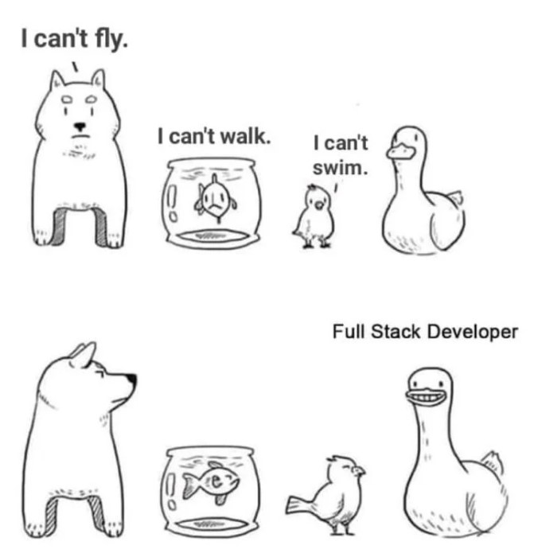

SOLID stands for 5 basic principles that can be applied in object-oriented programming and design to make your code 
maintainable, flexible, testable, understandable, and more robust. These principles were introduced by Robert C. Martin, an American software engineer, author of the agile manifesto, software design guru, and best-selling author.

Back when I was a student and started with programming I heard the term "SOLID principles" a lot. For a long time, I was running away from SOLID principles as they were really confusing and kinda scary for me. After I spent a lot of time refactoring my code multiple times and being frustrated by that knowing that I am doing something wrong, I decided to face the reality and learn them. 

SOLID principles are not something you can just easily read one time and consider that you know them. You need to apply them with every JIRA ticket that you complete in your day-to-day job. You need to keep them in mind all the time, and it takes time and practice. 

SOLID principles are: 
- The **S**ingle Responsibility Principle
- The **O**pen-Closed Principle
- The **L**iskov Substitution Principle
- The **I**nterface Segregation Principle
- The **D**ependency Inversion Principle

## 1) Single Responsibility Principle (SRP)

This principle states *"a class should do one thing and therefore it should have only a single reason to change."* 

So from real-world examples, we can take a spoon and fork as an example. Each of these eating tools is doing only one thing. Now imagine that you have a spoon and fork merged in one tool and you get spoon-fork or maybe a better name is spoork. It would be awkward and probably hard to use.

I did some research and if you like to violate the single responsibility principle in real life, you can order this monstrosity for circa 4 bucks at AliExpress [here](https://www.aliexpress.com/item/1005002883934407.html). 


Now let's go to the code example. First I will show a bad example, then explain why it's bad, and then show a good one. All examples are in TypeScript.

```typescript
class Patient {
  public firstName: string;
  public lastName: string;
  public email: string;
  public age: number;

  public savePatientReport(): void {
    // here is code to generate PDF report for patient
  }
}
```

We can see in the example above that this class is doing 2 things:
- it is used as a model for patient data
- it can generate PDF reports for patient data

To fix the single responsibility principle, code should be split into 2 classes:

```typescript
class Patient {
  public firstName: string;
  public lastName: string;
  public email: string;
  public age: number;
}

class ReportGenerator {
  public saveToPdf(patient: Patient): void {
    // here is code to generate PDF report for patient
  }
}
```

```Patient``` and ```ReportGenerator``` are now 2 different classes. The patient is used as a model for patient data, while ```ReportGenerator``` can generate a PDF report for patient data. Tomorrow, if you need to implement an Excel spreadsheet report from patient data, things will be much easier with this modification.

## 2) Open-Close Principle (OCP)

This principle says that *classes should be open for extension and closed to modification*. 

So what this principle means is that we should be able to add new features to the class without affecting the old code. This is because whenever we edit old code, we run the risk of introducing potential problems. So, if at all possible, we should avoid touching the proven and trustworthy (mainly) production code. 

A good example of this is a mixer and its extensions. You can attach an extension to the mixer and use it without digging inside the mixer's encapsulated body.


Now let's see the code example. First, bad example.

```typescript
class Midfielder {
  public assists: number;
  public goals: number;

  constructor(assists: number, goals: number) {
    this.assists = assists;
    this.goals = goals;
  }
}

class Goalkeeper {
  public saves: number;
  public passes: number;

  constructor(saves: number, passes: number) {
    this.saves = saves;
    this.passes = passes;
  }
}

class GameRatingCalculator {
  public calculateMidfielderRating(midfielder: Midfielder): number {
    return midfielder.assists + (midfielder.goals * 2);
  }

  public calculateGoalkeeperRating(goalkeeper: Goalkeeper): number {
    return (goalkeeper.passes / 3) + (goalkeeper.saves * 2);
  }
}
```

Above we can see the code which calculates the game rating points for 2 types of football players, ```Midfielder``` and ```Goalkeeper```. The problem here is that if we add a new type of player, for example, a defender, we will need to add a new method in ```GameRatingCalculator``` class. 

So it's better to add a new interface respecting the open-close principle. Here is the improved version of the code:

```typescript

interface Player {
  calculateGameRating(): number;
}


class Midfielder implements Player {
  public assists: number;
  public goals: number;

  constructor(assists: number, goals: number) {
    this.assists = assists;
    this.goals = goals;
  }

  public calculateGameRating(): number {
    return this.assists + (this.goals * 2);
  }
}

class Goalkeeper implements Player {
  public saves: number;
  public passes: number;

  constructor(saves: number, passes: number) {
    this.saves = saves;
    this.passes = passes;
  }

  public calculateGameRating(): number {
    return (this.passes / 3) + (this.saves * 2);
  }
}

class GameRatingCalculator {
  public calculateRating(player: Player): number {
    return player.calculateGameRating();
  }
}
```

With the introduction of the new player type ```GameRatingCalculator``` class now doesn’t have to be changed. This is achieved with an interface that consists of common things across the player types.

## 3) Liskov Substitution Principle (LSP)

According to this principle, *a program's objects should be able to be replaced with instances of their subtypes without affecting the program's correctness*.

Good examples of the Liskov substitution principle are mammals. For example, a duck is a bird that can fly, swim and walk. On the other hand, the dog is also a mammal, but it can't fly, it can only walk and swim. So for both dogs and ducks, we can say that they are mammals, keeping in mind their natural behavior correctness.



Here is the code example:

```typescript
class Player {

  public kickBallWithFeet(): void {
    console.log("Kicking the ball with feet!")
  }

  public holdBallWithHands(): void {
    console.log("Holding the ball with hands!")
  }
}

class Goalkeeper extends Player {}

class Defender extends Player {}

```

We can see in the above example that the Liskov substitution principle is violated since both ```Goalkeeper``` and ```Defender``` extends ```Player `` class which implies that both types of players can kick the ball with their feet and hold the ball with their hands. 

This is correct for the ```Goalkeeper```, which can use both feet and hands in the game within his goalkeeper zone. But for ```Defender```, he can only use feet in the game as playing with hands for all the players except the goalkeeper is forbidden in football (soccer).

Let's correct this code:

```typescript
class Player {

  public kickBallWithFeet(): void {
    console.log("Kicking the ball with feet!")
  }
}

class HandsUsingPlayer extends Player {
  public holdBallWithHands(): void {
    console.log("Holding the ball with hands!")
  }
}

class Goalkeeper extends HandsUsingPlayer {}

class Defender extends Player {}

```

Now every type of player can only perform allowed in-game actions.

## 4) Interface Segregation Principle (ISP)

The interface segregation principle states that *no code should be forced to depend on methods it does not use*. No client should be forced to rely on methods that they do not employ.

A good real-life example of a company that respects this principle is Apple with its dongles. Just look at these things:


So for each type of cable, you have a specific dongle. I am not so good at explaining why they introduced this change, but the legendary "El Risitas" explained it [here](https://www.youtube.com/watch?v=-XSC_UG5_kU) perfectly. 

Now let's jump to the code example:

```typescript

interface Animal {
  fly(): void;
  walk(): void;
  swim(): void;
}

class Dog implements Animal {
  
  public fly(): void {
    // a dog can't fly
  }

  public walk(): void {
    // some method
  }

  public swim(): void {
    // some method
  }
}
```

The problem here is that we violate the interface segregation principle by using all methods in one interface instead of multiple interfaces. Let's correct that:

```typescript

interface Walker {
  walk(): void;
}

interface Swimmer {
  swim(): void;
}

interface Flyer {
  fly(): void;
}

class Dog implements Walker, Swimmer {

  public walk(): void {
    // some method
  }

  public swim(): void {
    // some method
  }
}
```

With the separation of interfaces, we can specify which actions a specific entity can perform.

## 5) Dependency Inversion Principle (DIP)

This one is a bit confusing. It says *depend upon abstractions, not concretions*. It states that our classes should depend upon interfaces or abstract classes instead of concrete classes and functions.

One good real-world example is a plug and power socket. It doesn't care if the wires behind the power socket are from aluminum or copper to do the job. Why? Because it doesn't depend upon concretions (type of wires behind power socket) but upon abstraction (type of power socket, it can be EU/US).


Now, let's look at our code example

```typescript
class Goalkeeper {
  public stopShoots(): void {
    // some method
  }
}

class Defender {
  public defend(): void {
    // some method
  }
}

class Midfielder {
  public passTheBall(): void {
    // some method
  }
}

class Attacker {
  public scoreGoals(): void {
    // some method
  }
}

class FootballMatch {
  public goalkeeper: Goalkeeper;
  public defender: Defender;
  public midfielder: Midfielder;
  public attacker: Attacker;

  constructor() {
    this.goalkeeper = new Goalkeeper();
    this.defender = new Defender();
    this.midfielder = new Midfielder();
    this.attacker = new Attacker();
  }

  public playFootballMatch(): void {
    this.goalkeeper.stopShoots();
    this.defender.defend();
    this.midfielder.passTheBall();
    this.attacker.scoreGoals();
  }
}
```

As you can see in the above example, we are really on exact implementations of core classes and their functions. However, given how similar these classes are and how they will act similarly, this approach is incorrect. Therefore, there is a better way to meet the conditions necessary to realize the purpose of the Dependency Inversion Principle.

```typescript

interface Player {
  play(): void;
}

class Goalkeeper implements Player {

  public play(): void {
    this.stopShoots();
  }

  public stopShoots(): void {
    // some method
  }
}

class Defender implements Player  {
  
  public play(): void {
    this.defend();
  }

  public defend(): void {
    // some method
  }
}

class Midfielder implements Player {
  
  public play(): void {
    this.passTheBall();
  }

  public passTheBall(): void {
    // some method
  }
}

class Attacker implements Player {
  
  public play(): void {
    this.scoreGoals();
  }

  public scoreGoals(): void {
    // some method
  }
}

class FootballMatch {
  public players: Player[];

  public playFootballMatch(): void {
     this.players.forEach((player: Player) => {
      player.play();
    });
  }
}
```

Since we already know all the other principles, it's even simpler than I originally stated.

We first design an interface named ```Player```. We rely on ```Goalkeeper```, ```Defender```, ```Midfielder```, and ```Attacker``` on the ```Player``` interface because they are comparable classes.

Instead of initializing ```Goalkeeper```, ```Defender```, ```Midfielder```, and other classes in the ```FootballMatch``` class one by one, we take a list of them and call each ```play()``` method iteratively.

# Conclusion

I hope I could help you brush up on your knowledge or pick up some new information. My advice is to remember these guidelines as you design, write, and refactor your code to make it much cleaner, more extensible, and testable.

