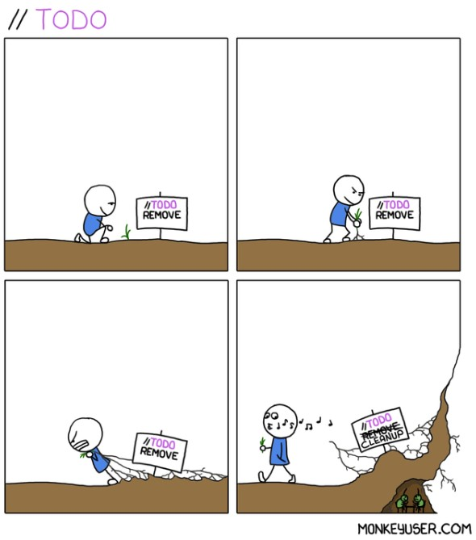

## Three sides of the story

One of the most discussed things in programming is about comments in the code. From what I saw in practice there are 3 kinds of developers:
- developers who think that comments are a ”must have” in the code
- developers who are against comments in the code
- developers who think about comments as something situational and optional

There is no right answer to this dilemma and truth is somewhere between options mentioned above.


## "Day to day work" patterns

From day to day work I have experienced 2 repetitive patterns:
- code bloated by comments in such a way that almost every line is commented. Even the simple code which is really redundant to comment. Reminds me of one of my students at college, she would bring solutions like this so when I asked her to explain the code, she would just read those comments. Sadly, comments didn’t help her when I asked her to change some functionality in the code. 
- not a single line of commented code. Usually this pattern goes together with no documentation about the project. In most cases, this pattern is noticed by developers when an older project/legacy code is inherited. Developers try to read the code multiple times and spend a good chunk of their time trying to figure out what the author tried to accomplish then.


In this blog post I will explain my views and arguments about comments in the code.

## Ugh, who wrote this?

Probably the biggest reason to write comments in the code is to explain what that code is doing, to describe code behaviour. There are a lot of arguments for and against this practice, but one of the strongest arguments is the fact that new developers need to understand the code. Due to the natural circle of life in IT companies, where current developers move on, new developers join the team and people switch projects, these arguments sound pretty valid. Companies build products with the intention that code will live for decades.

## Code as a source of truth

I totally understand previously explained arguments, but in my opinion code should be the only source of truth, not comments. My problem with code comments is that comments can not guarantee that code will behave as described in the comments. That totally depends on the author of the code and a lot of other things like refactorings, change requests, upgrades, bug fixes, optimizations that have been applied to the code for years and years. 

One small change in the code can make code comments totally misleading and worthless. We don’t know if the code comment was updated every time the code has been changed. In that case, code comments can be even dangerous and in these situations, no code comment is better than having misleading code comments.

My opinion is that code should be like poetry, when you read it, you should have a feeling that you are reading sentences from a kid who is trying to learn how to write sentences. They are not grammatically correct but you have a clear understanding of what that sentence means. When you read it, words just stick to each other and you can see the meaning behind it.
To achieve this you can use clean code techniques like good naming conventions, descriptive variable names, modularity, manageable complexity, etc. Let’s see this small code snippet:

```js
function status(p){
  if(p.status == 0) return 0;
  if(p.status > 0) return 1;
  if(p.status < 0) return 2;
}
```

When you read this code, do you understand what it is doing? What problem does that code solve? 
Here, some comments would be definitely helpful, but before adding a comments let's first refactor the code a bit:

```js
const PATIENT_STATUSES = {
  UNAUTHORIZED: 0,
  NEW: 1,
  DEACTIVATED: 2
};

function getPatientStatus(patient){
  if(patient.status === 0){ 
    return PATIENT_STATUSES.UNAUTHORIZED;
  }
  if(patient.status > 0){ 
    return PATIENT_STATUSES.NEW;
  } 
  return PATIENT_STATUSES.DEACTIVATED;
}
```


Is it better now? 

## Keep it simple, stupid (KISS)

The above code snippet tells us a story that bad code should not be commented. It should be refactored. This is also situational as sometimes code can be complex because business logic is complex or it can be intimidating at the first look without knowing what should that code accomplish. Let's take a look at this code example:

```js

import dayjs from 'dayjs';

function calculateAge(birthDate, screeningVisitDate) {

  const screeningDate = dayjs(screeningVisitDate, 'MMM D, YYYY')
  const bDate = dayjs(birthDate, 'MMM D, YYYY')

  const years = screeningDate.diff(bDate, 'years')
  bDate.add(years, 'years')

  const months = screeningDate.diff(bDate, 'months')
  bDate.add(months, 'months')

  const days = screeningDate.diff(bDate, 'days')

  return { days, months, years }
}

```


Even though we can perfectly understand what is done in the code, we still don’t know what this function is doing, when we should use this function and what this code accomplishes. 
Now let’s see how it looks when we add an explanatory comment:


```js
import dayjs from 'dayjs';

/**
 * calculates Age per specified formula
 * Example:
 * Birthdate of the subject is 03-Aug-2018
 * Screening date is the 15-Sep-2021
 * Subject is 3 years, 1 month and 12 days old (day 15 - day 3 = 12 days)
 * @param {string} birthDate - users birthdate
 * @param {string} screeningDate - users screening date
 * @returns {object} object with days, months, years properties
 */
function calculateAge(birthDate, screeningDate) {

  const screeningDate = dayjs(screeningDate, 'MMM D, YYYY')
  const bDate = dayjs(birthDate, 'MMM D, YYYY')

  const years = screeningDate.diff(bDate, 'years')
  bDate.add(years, 'years')

  const months = screeningDate.diff(bDate, 'months')
  bDate.add(months, 'months')

  const days = screeningDate.diff(bDate, 'days')

  return { days, months, years }
}

```

In situations like this, comments can be helpful. When a new developer looks at the above code snippet without code comment, understanding the logic behind it can be challenging. We need to be aware of what information we share through comment. You don’t need to comment on each and every step. Be short, concise and on-target. 

I usually ask myself, what is the most important piece of information that I can bring to the next developer so that I make their life easier and be sure that developer doesn’t mention me and my family while trying to understand the code I wrote.

## //TODO - just do it... later

My opinion about //TODO comments is divided, depending on the situation. I have nothing against TODO comments but only if they are short lived and put in the code with intention to not block things in the development process. Good example of TODO comment is following:

```js

//TODO - change the email template name when product owner finishes it
const EMAIL_REMINDER_NOTIFICATION_NAME = "default_email_template";

```

This can be easily changed later, it is just one line of code. Developer who submits the merge request with this comment is aware that this is not the final version of implementation and he tested implementation logic with the default template. 

Code works properly so why wait and block the development process if 99% of work is done? Before the code gets migrated from DEV to QA and the production server, the email notification template will be finished for sure. So instead of blocking the development process and wasting time, the developer submitted the code and moved to the next ticket.

I usually keep TODO comments while the feature is being developed. If the feature branch gets pushed into the main branch, I remove TODO comments from the code and create backlog tickets. 



## Your *comments*

Thanks for reading! I would like to hear your *comments* (pun intended) on how you comment your code. 

Cheers!
