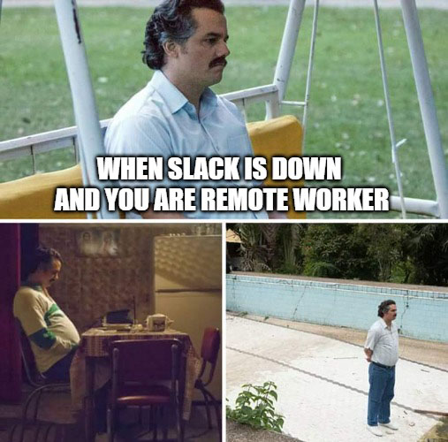
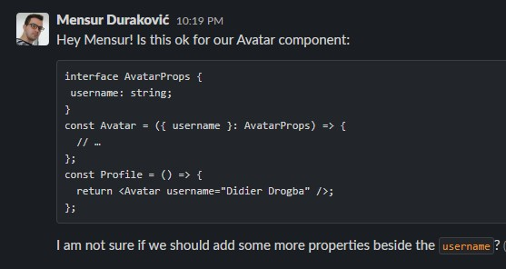
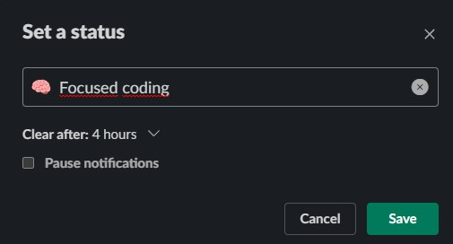

I think about Slack as a work-related Sims game, we just don’t have 3D characters/avatars (yet). A bunch of people gather there 5 days a week, 8 hours per day working on a common goal. So it is pretty much necessary to behave well and not disturb your work buddies. Slack is really important tool if you are pure remote worker.

Here are some tips for good Slack bon ton:

## 1. Analyse and review message before sending

I have one colleague, she is a QA, very skilled and dear one. She likes to send me messages in this style:

*Hi Mensur, how are youuu?*

If you are a developer, you know that QA guys will rarely message you to go together on coffee or lunch break. It usually means there is a problem/bug and you need to fix it. 

Now my dear colleague likes to build a bit of tension with writing messages like above, then wait a bit and finally proceed to write a message with context. I joked with her to send me this message Friday at 17h for a full effect. 

When you send a message with “Hi” or “Hello” it means nothing for the recipient, no context. Even if you follow up in the next message with something more meaningful, the recipient will get the notification, read your message and wait for your next message watching your typing indicator (you can also disable typing indicator in settings). 

You can say “Hi” or “Hello” in your first line, but then instead of hitting enter, use shift + enter to move to the next row and type a full message.

Let’s take this example:

*11:44 AM Hey Mensur, I have some problems related to banners screen*

*11:44 AM The data is not displayed correctly in X banner*

*11:45 AM Sorry, I mean Y banner*

*11:45 AM I tried to change the data in CMS and generate it again but I got errors again.*

*11:45 AM Do you know maybe why it is not working?*

Multiple messages will produce multiple Slack message sounds, which means multiple distractions and that’s not what you want to do to your colleagues. Above messages could be refactored to something like this:

*11:44 AM Hey Mensur, I have some problems related to the banners screen. The bug is visible in the Y banner on X screen. I tried to change the data in the CMS but no luck, again the same error and text is not displayed. Can you take a look?*

Before sending a message, always ask yourself: How can I type this message in a clear and simple way so that the recipient is not annoyed and understands what I am talking about?

## 2. Structure your message properly

This one is pretty simple. We humans are visual types, we scan and read messages, so it is always good to format it with lists if you need to discuss a few items/topics. 

If you are sending code snippets in a message or mentioning some specific programming keywords you can mark it with “code block” or “code” formatting to make messages easier to understand. Here is an example:

[Here](https://slack.com/blog/collaboration/designing-and-formatting-messages-in-slack) you can read more good tips on formatting and structuring Slack messages.

## 3. Stop honking with @channel and @here

Be very careful when you use these. 

If you use @channel, you will notify everyone in the channel. This will create a notification (mobile/desktop), no matter if the user's availability is set to active or away. It should be used for high urgency, eg. someone parked a car and blocked an entrance and you want the owner to move the car.

On the other hand, @here will notify currently active channel members, which means those who are not active, won’t be notified about your message. You can ask a question about a problem you are facing and get a quick response from team mates who are working or notify your colleagues that you are aware that the X service is slow today and that the team is working on it.

## 4. Threads are good

If you are in the channel with 50 people and you ask a question, then the other person answers directly in the channel, conversation goes like that for the next 10-15 messages other channel members will get an unread indicator every time a new message arrives and this will cause a good amount of disturbance. 

Instead if the person who answered a question replied in the thread, nobody else would be notified. This would keep the relevant conversation in one place and not in 20 different direct messages, leaving the main channel clean and more organised. 

Also, sometimes other topics can jump into your discussion in the main channel, which is one more argument to use threads. 

## 5. Let's huddle

If a colleague messages me asking for help and we spend more than 5 minutes typing and discussing the problem, I usually suggest jumping on huddle. 

It is much much easier and faster to discuss things and debug problems that way instead of typing and wasting time writing about more complex issues.
For us developers, it is very handy as you can share the screen, show the code, reproduce the issue and debug things together.

Keep in mind, huddles do not have messages history, so I usually send important things (eg. code snippets or documents) in the chat, while on huddle, so that other person can use it after the call and have it in our chat history.

## 6. Set status and DND schedule

Communicate with your colleagues clearly when you need to focus on work so they know when is the proper time to ping you. We are all different, and while someone is productive early in the morning, others can be productive in the middle of the day or later.

I don’t use statuses very often, but when I really want to finish something without disturbance I use status:

You can use it also to communicate that you are on lunch, on holiday, taking a sick day, etc. Then when you come back, you can clear it.
"Do not disturb" schedule is also a great built-in tool that you can use to set your outside-of-work hours and avoid getting notified.

## 7. Use emojis and reactions when appropriate

Generally, I like to use emojis. For me, they are a great way of communicating without making other people think that you are too stiff. For example if you type something like this:

*I will finish the promotions screen later today.*

This message might sound to the recipient(s) that you are annoyed. As we don’t know how this message will be received and what will colleagues think when they read it, we can add emoji to it which will make our message look more smooth and joyful:

*I will finish the promotions screen later today* 👍

Reactions are basically emojis that you can put on other messages. I like to use them a lot, because you can: 
- put 👀 on your colleagues' merge request link so that others know you are reviewing the code
- put ✅ to acknowledge that you read a message for filling up time sheets today
- put 👍 to show your approval
- put 🎉 on birthday wish message for your colleague instead of spamming

This approach minimises notifications and eliminates “thank you” and “you too” back and forth messages. Also, don’t use reactions when an answer in the form of a message is needed.

That’s all! 

If you have any other good Slack tips, notify me with @channel and let me know 😁
