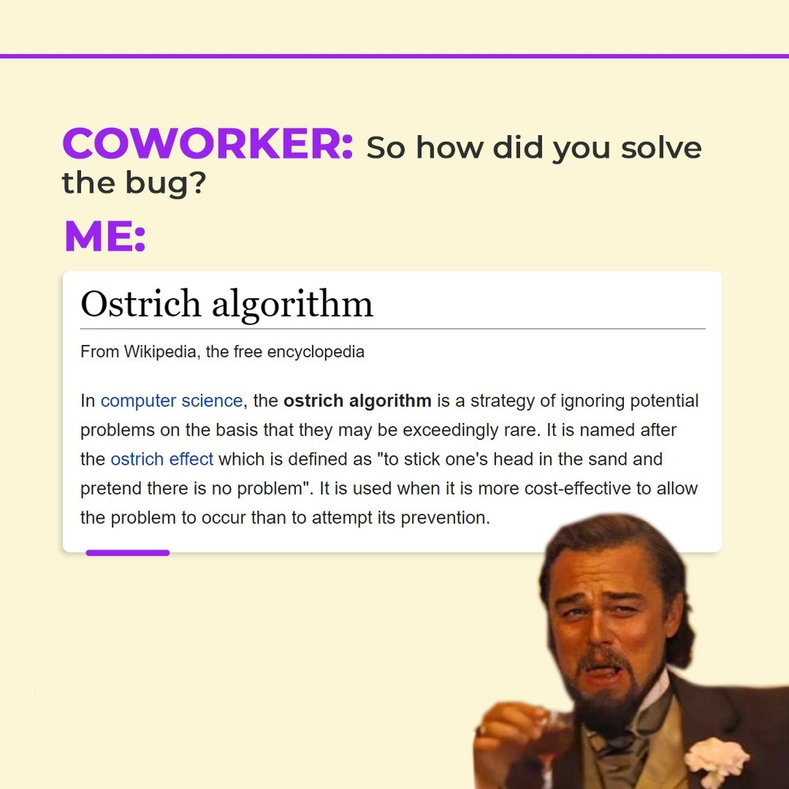
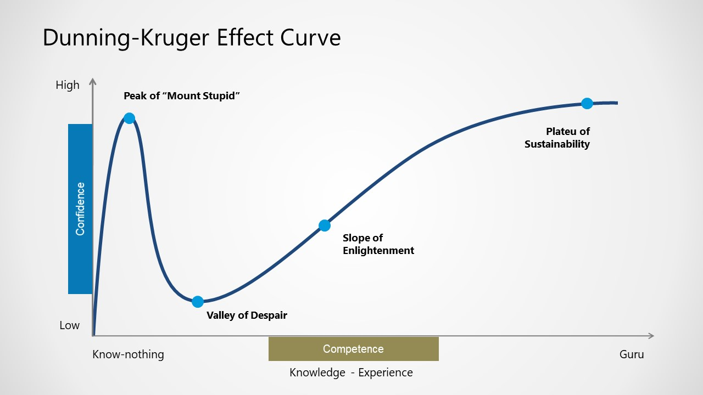

Since the first day at work as a software developer I have noticed some of the laws and principles are occurring more often than others. Here is list of my 7 favourite ones:

## 1. Murphy's law - Anything that can go wrong will go wrong

When I was a young and inexperienced junior, I made a lot of bugs. I would code something and test only the bare minimum, not thinking about edge cases and what will happen if users do this or that.

I remember I was working on a project where I needed to fix a bug in my script that was preventing Raspberry Pi device connecting to WiFi network. There are 2 ways to connect a Raspberry Pi device to WiFi network, one with WiFi dongle, and the classic way with on-board WiFi module.

I fixed the bug and tested only the classic way, as I was sure that my code is good and there is no need to test the use case with WiFi dongle.
Needless to say, tomorrow morning the bug was reopened and I was testing the code, only to discover that I made a typo in my Python script. Something like this:

```
wifiConfig[“Wifi”] = wifiName
```

and it should be:

```
wifiConfig[“WiFi”] = wifiName
```

One letter typo. 

From that point I learned my lesson and even though I always do the testing part, Murphy's law is always there to remind me of its existence.

## 2. Hanlon's Razor - Never attribute to malice that which is adequately explained by stupidity

A lot of IT folks have a tendency to say that a normal user has the IQ of a room lamp. As it might be true for some users, for most of them it’s Hanlon’s Razor law. I mentioned the Raspberry Pi project in Murphy's law above, so let’s use it here for Hanlon’s Razor law as well.  

One day, I came to work and my manager told me that one of our clients encountered a critical bug where they can’t see anything on the screen. Basically, the Raspberry Pi device was programmed to download videos and open web URLs to display them on the screen for a certain time interval.

I spent half a day trying to reproduce it, but no success. After communicating with our client, they sent me videos and web URLs that they were using.

Videos were played on Raspberry Pi device without a problem, but when I tried to open the URL, nothing was displayed, just white screen. Later, I tried to open their URL on my PC. As soon as I opened it, the CPU hit 100% and my PC froze. 

It was a strong machine with an Intel i5 processor with 16GB of RAM. Website was just loading and loading and loading. After it was finally loaded I saw that it was a simple 3x3 grid which displayed some images. I saved the website content and inspected it. 

It was a shock for me when I saw really “fat” image files with insanely high resolution I never saw before. Something like 13000x7000 px. Each image was 300-500 MB heavy.

No wonder that poor little Raspberry Pi device with 1GB RAM was dying while trying to open this website.

Later, I found out from a client that their designer created this website in some HTML editor and published it. It was a really good test for my nerves to communicate to the client what happened in a nice and polite way. 

Hanlon’s razor at its finest. 


## 3. Ostrich effect - The tendency to avoid dangerous or negative information by simply closing oneself off from this information

There is a special kind of this effect in software development, called an Ostrich algorithm. 

[Wikipedia](https://en.wikipedia.org/wiki/Ostrich_algorithm) says: “In computer science, the ostrich algorithm is a strategy of ignoring potential problems on the basis that they may be exceedingly rare. It is named after the ostrich effect which is defined as "to stick one's head in the sand and pretend there is no problem". It is used when it is more cost-effective to allow the problem to occur than to attempt its prevention.”



One of the best examples for this is Gmail’s undo option. Users noticed that there was a 7 seconds delay in actually triggering the mail from the server which was later introduced as an “undo” feature.

This is a combination of an ostrich algorithm and “it’s not a bug, it’s a feature”. 

## 4. Brooks's law - Adding manpower to a late software project makes it later

Some project managers love this law. I mean they love to disrespect it. 

They are dead serious about thinking that 9 women can deliver a baby in 1 month, totally not aware of Brook’s law. 

I experienced this when some project is on tight deadlines, then the project manager moves a couple of devs from another team/project to help deliver the project on time. 

After that, new developers need to learn about the project, business logic and it takes some time. Naturally, new developers will ask questions about the current state of the project and code. 

Guess who will answer and help those new developers? Yep, you are right, current developers will need to do it, not the project manager.


I think it would help to add this law in agile certifications for project managers. This is not a good way to help deliver the project on time, unless new developers have experience and knowledge of projects business logic.

## 5. Hofstadter’s law - It always takes longer than you expect, even when you take into account Hofstadter's Law

Dealing with estimations is a very important part of a developer's job. And it sucks. You learn to respect Hofstadter’s law the hard way. 

As a junior developer, you are not experienced and when estimation is asked you tell exactly the time you think it will take to finish a feature.

This is almost always wrong as you don’t take into account possible problems that you will encounter during the implementation, bugs that will occur, testing time and other factors. 

Therefore you end up in a stressful situation trying to finish the feature as soon as possible as fire is burning under your legs.

Later as you grow up, you learn that you should leave a bit of time buffer for implementation but somehow  it is never accurate.

My personal formula when asked for estimates is to add 50% on top of the time I think it will take to implement something. This leaves you in a nice spot to finish implementation without looking at the clock and if you finish the feature earlier, you will be a hero.

## 6. Dunning-Kruger Effect - Occurs when a person's lack of knowledge and skills in a certain area cause them to overestimate their own competence

Every developer knows at least one other developer that is affected by this “disease”. 

Some developers have high ego, which manifests in different forms like thinking they know all, refusing to admit that they are wrong, going crazy on code reviews when they receive feedback and many other things.

I remember, freshly from the college I was stupid enough to believe that if I had Java course in the college I can put Java in my CV and tell everyone that I know Java programming language perfectly. 

Oh boy, how I was wrong. I barely knew the basics.

Later through projects I learned how much I know nothing and I still need to learn a lot. I also learned that I should never say that I know everything about some programming language.

That’s how Dunning-Kruger curve looks like:



## 7. Mosher's Law - Don't worry if it doesn't work right. If everything did, you'd be out of a job

Last one and my favourite. 

Like everyone else, in the first two years working as a software developer I struggled with stress. Thinking about problems, bugs that I need to fix, possible solutions and future scenarios. 

Often I would overthink about some problems while showering. My mind would slowly drive away until cold water woke me up. Often, it was just overthinking about the problems, what if I don’t solve it, what if my manager is not satisfied with me, what if I get fired, etc.

After years, many projects and a couple of good self-help books I learned that there is no use of worrying and problems are normal things in this domain of work. 

It takes quite some time for developers to understand that their job is not to write nice code, build fancy web sites and use the latest cutting-edge technologies. 

A developer's job is to solve problems. 

Solving problems is not an easy skill to learn, it takes time, effort and dedication. So next time you have difficulties, accept it as a part of your job and don’t stress about it.

## Conclusion

This list is not a definitive list of “software’s laws”, I’m sure you could add some more and perhaps find fault with some that I explained above. Did I miss your favourite law? Do you have any (funny) experience with one of them? Let me know 😊