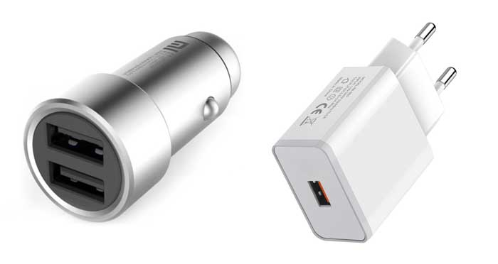

After [part 1](https://mensurdurakovic.com/blog/the-most-important-design-patterns-part-1/), where creational design patterns were explained, the second part is about structural design patterns. While creational design pattern offers developers various object-creation mechanisms, structural design patterns are all about combining those objects and classes into larger structures while keeping them flexible and efficient.

We will go through 7 design patterns:
1. Facade
2. Decorator
3. Composite
4. Adapter
5. Bridge
6. Proxy
7. Flyweight

Each pattern will be described by use-case from real-life and TypeScript code examples.

## 1) Facade

A facade is a design pattern usually used when you have a relatively complex set of features to enable easy handling of these features in a way that guards the consumer against that complexity. 

This usually happens as the project matures over time when more and more features are implemented or modified. 

A good real-life example of a Facade pattern is a restaurant. When you go to a restaurant, a waiter takes your orders and you have no clue what is happening after that. A whole set of actions take place, the waiter takes your orders to the kitchen and a bar, the barista needs to make your drinks, the wine must be prepared, the chef accepts the orders, food ingredients are being prepared by helper chefs, etc.


You as a guest aren't aware of any of these complex actions, and that's the way it should be.

Let’s implement a facade pattern in this restaurant-like scenario:

```typescript
class Waiter {
  public welcomeGuests(): string {
    return "Waiter: welcome guests!\n";
  }
  public takeOrders(): string {
    return "Waiter: take orders!\n";
  }
}

class Chef {
  public acceptOrders(): string {
    return "Chef: accept orders!\n";
  }
  public prepareMeals(): string {
    return "Chef: prepare meals!";
  }
}

class Restaurant {
  protected waiter: Waiter;
  protected chef: Chef;

  constructor(waiter?: Waiter, chef?: Chef) {
    this.waiter = waiter || new Waiter();
    this.chef = chef || new Chef();
  }

  public acceptGuests(): string {
    let result = "Restaurant initializes services:\n";
    result += this.waiter.welcomeGuests();
    result += this.waiter.takeOrders();
    result += this.chef.acceptOrders();
    result += this.chef.prepareMeals();
    return result;
  }
}
```

First, we have 2 classes, a ```Waiter``` and a ```Chef```. We could add more but for the sake of simplicity 2 classes are enough. Each of these classes contains methods that are related to their specific actions. 

The next class is ```Restaurant```, which accepts ```Waiter``` and ```Chef``` in a constructor and has only one method which is used to execute a chain of actions. These actions can be in any order and from any sub-system (```Waiter``` or ```Chef``` or something else).

Now let’s test this code:

```typescript
function guestVisit(restaurant: Restaurant) {
  console.log(restaurant.acceptGuests());
}

const waiter = new Waiter();
const chef = new Chef();
const restaurant = new Restaurant(waiter, chef);
guestVisit(restaurant);

/* output
"Restaurant initializes services:
Waiter: welcome guests!
Waiter: take orders!
Chef: accept orders!
Chef: prepare meals!"
*/
```

As you can see, with just one exposed method, a whole set of complexity hidden from a consumer can be executed.

## 2) Decorator

The decorator pattern is an interesting one, it lets you attach functionality to an object, at runtime. This allows you to introduce an extension to a current feature, without refactoring the code of that feature. 

The decorator basically forwards all these requests to that enclosed object and executes these extra actions. These requests can also work in a recursive fashion.

Now, imagine you have a feature for notifications in your project. Currently, it only sends email notifications. Then clients decide that they want also Slack and SMS notifications.


This is a lot of combinations for a notification feature as users can receive only one notification but also can receive all 3 types of notifications, depending on preferences.

Situations like these can be solved by decorator pattern, so let’s jump to the code:

```typescript
interface INotifier {
  notify(): string;
}

class EmailNotifier implements INotifier {
  public notify(): string {
    return "Notify by email!";
  }
}

class Notifier implements INotifier {
  protected notifier: INotifier;

  constructor(n: INotifier) {
    this.notifier = n;
  }

  public notify(): string {
    return this.notifier.notify();
  }
}

class SlackNotifier extends Notifier {
  public notify(): string {
    return `Notify by Slack! (${super.notify()})`;
  }
}

class SmsNotifier extends Notifier {
  public notify(): string {
    return `Notify by SMS! (${super.notify()})`;
  }
}
```

Starting with ```INotifier```, a simple interface with ```notify``` method. 

Next is ```EmailNotifier``` class which implements ```notify``` method and sends the notification via email.

The next class is the most interesting one, a ```Notifier```. It accepts a new instance of ```INotifier``` and also implements ```notify``` method. This way we can ensure recursive notifying of multiple instances.

How? Let’s test it:

```typescript
function executeNotifications(n: INotifier) {
  console.log(`RESULT: ${n.notify()}`);
}

const email = new EmailNotifier();
executeNotifications(email);
// "RESULT: Notify by email!"

console.log("");
const slack = new SlackNotifier(email);
const sms = new SmsNotifier(slack);
executeNotifications(sms);
// "RESULT: Notify by SMS! (Notify by Slack! (Notify by email!))"
```

The first example is a very simple one, ```emailNotifier``` which notifies the user via email.

The second example is a more complex one, as it takes ```emailNotifier```, and passes it to the ```slackNotifier```, which is then passed to the ```smsNotifier```. 

As you can see, the output is indeed recursive. Notifying through SMS, then Slack, and finally email.

## 3) Composite

This design pattern is good for situations where you have data that you need to represent in a hierarchical or tree-like order.

The composite pattern allows you to represent individual objects or groups of these objects as the same while allowing you to take care of the composition of these objects and groups.

It also allows you to add new or remove existing objects while maintaining flexibility.

A good example of a composite pattern is a company structure. Company is the top object, then you have different branches like marketing or engineering. After that, you have workers which work under different branches, managers, or normal workers.


Let’s show that example in the code:

```typescript
interface IWorker {
  work(): void;
}

class CompanyWorker implements IWorker {
  private position: String;
  constructor(position: String) {
    this.position = position;
  }
  public work(): void {
    console.log(`'work' method of ${this.position} is called.`);
  }
}

class Company implements IWorker {
  private workers: IWorker[];
  private position: String;

  constructor(position: String) {
    this.workers = [];
    this.position = position;
  }

  public work(): void {
    console.log(`'work' method of ${this.position} is called.`);
    for (var i = 0; i < this.workers.length; i += 1) {
      this.workers[i].work();
    }
  }

  public add(c: IWorker): void {
    this.workers.push(c);
  }

  public remove(i: number): void {
    if (this.workers.length <= i) {
      return;
    }
    this.workers.splice(i, 1);
  }
}
```

The base of this example is the interface ```IWorker``` and ```work``` method. 

Then there is the class ```CompanyWorker``` which implements the ```work``` method while accepting a ```position``` in the constructor.

Another class ```Company``` also implements the ```work``` method, but it also contains ```add``` and ```remove``` methods, which offer flexibility to add or remove objects from the tree.

Let’s see it in action:

```typescript
function startWorking(w: IWorker) {
  w.work();
}

const developer = new CompanyWorker("Developer");
startWorking(developer);
//"'work' method of Developer is called."
console.log("");

const company = new Company("Google");

const engineeringBranch = new Company("engineering");
engineeringBranch.add(new CompanyWorker("QA Engineer"));
engineeringBranch.add(new CompanyWorker("Software Developer"));

const marketingBranch = new Company("marketing");
marketingBranch.add(new CompanyWorker("Copywriter"));

company.add(engineeringBranch);
company.add(marketingBranch);

console.log("Now I've got a composite tree:");
startWorking(company);
/*
"'work' method of Google is called."
"'work' method of engineering is called."
"'work' method of QA Engineer is called."
"'work' method of Software Developer is called."
"'work' method of marketing is called."
"'work' method of Copywriter is called."
*/
console.log("");
```

The first example is a simple one, a developer as a worker, doing some work.

The next example is a more complex one. There is a ```Company``` called Google. Followed by 2 branches of engineering and marketing.

Both branches have some workers assigned. The engineering branch has a developer and a QA engineer, while marketing has a copywriter.

Work as a process can start from a single worker (first example - solo developer) as well as from a complex tree structure (second example - company)

## 4) Adapter

Sometimes, in a project, you have classes that are very similar but have different interfaces, so you can’t use them as you would like. Apart from that, you can't modify those classes so that it suits your needs as these classes are usually from some 3rd party or a different system.

To make these 2 classes interact with each other, you can build an Adapter pattern on top of the method signatures so it extends the functionality. 

You might think that the Adapter is similar to the decorator pattern. Indeed, it is but the difference is that adapter is not intended to use in a recursive way. The adapter is just an alternative interface to the existing one.

A good example of an adapter in real life is a translator. At the time of writing this article, the football world cup is kicking and usually, you can see journalists asking football players questions at the conferences before the football games.


However, the problem is that for example, a journalist that speaks English doesn't understand Spanish. So to be able to understand the Spanish-speaking footballer, he needs a translator (adapter).

Let’s put this example in the code:

```typescript
class EnglishSpeakingFootballer {
  public speakEnglish(): string {
    return "Answering questions in english language";
  }
}

class SpanishSpeakingFootballer {
  public speakSpanish(): string {
    return ".egaugnal hsinaps ni snoitseuq gnirewsnA";
  }
}

class Translator extends EnglishSpeakingFootballer {
  private player: SpanishSpeakingFootballer;

  constructor(player: SpanishSpeakingFootballer) {
    super();
    this.player = player;
  }

  public speakEnglish(): string {
    const translatedQuestion = this.player
      .speakSpanish()
      .split("")
      .reverse()
      .join("");
    return `Translator: ${translatedQuestion}`;
  }
}
```

```EnglishSpeakingFootballer``` and ```SpanishSpeakingFootballer``` are 2 basic classes, each one doing its own thing, English one has the ```speakEnglish``` method, while the Spanish one has the ```speakSpanish``` method. To make things simple, the ```speakSpanish``` method returns English text that is reversed.

The core is the ```Translator``` class, which extends ```EnglishSpeakingFootballer``` and implements the ```speakEnglish``` method. It also accepts the ```SpanishSpeakingFootballer``` instance in the constructor, so that it can translate the Spanish text into an English text.

Let’s see how this works:

```typescript
function askQuestionsInEnglish(target: EnglishSpeakingFootballer) {
  console.log(target.speakEnglish());
}

console.log("Journalist: I can talk with the EnglishSpeakingFootballer");
const target = new EnglishSpeakingFootballer();
askQuestionsInEnglish(target);
//"Answering questions in english language"
console.log("");

const spanishSpeakingFootballer = new SpanishSpeakingFootballer();
console.log("Journalist: The SpanishSpeakingFootballer class has a weird language. I don't understand it!");
console.log(`SpanishSpeakingFootballer: ${spanishSpeakingFootballer.speakSpanish()}`);
//"SpanishSpeakingFootballer: .egaugnal hsinaps ni snoitseuq gnirewsnA"

console.log("");

console.log("Journalist: But I can talk with footballer via the Translator:");
const translator = new Translator(spanishSpeakingFootballer);
askQuestionsInEnglish(translator);
//"Translator: Answering questions in spanish language."
```

The first example is just to prove that English to English doesn’t need an adapter. 

The second example is where the adapter comes into play. With the help of a translator, the journalist now understands the answer from a Spanish footballer.

## 5) Bridge

This design pattern is similar to an adapter, which is previously described. The only difference is that bridge is used to refactor the existing code, while the adapter creates an interface on top of the existing code without refactoring it.

Bridge lets you split a large class or set of tightly coupled functionalities into 2 important layers: abstraction and implementation.

Let's imagine that you have a smartwatch and a mobile phone. These devices need chargers, so that 2 chargers, one for each device as they have different ports a smartwatch has a USB-mini port while a mobile phone has a USB-C port.
You also want to charge your smartwatch and mobile phone in the car, so you need to buy 2 more chargers to fit the car socket. You end up with 4 different chargers with integrated cables, which is a lot of chargers.

Now let’s apply the bridge pattern to that situation. Instead of having a different type of charger with different integrated cables, you can buy an electric charger and a car charger with a USB port and removable USB-C and USB mini cables. This way you can have 1 normal electric charger and a car charger that you can use with different cables.



Let’s implement it in the code:

```typescript
interface ChargingCable {
  connect(): void;
}

class PhoneChargerCable implements ChargingCable {
  connect(): void {
    console.log("connect USB-C to Mobile Phone");
  }
}

class SmartWatchChargerCable implements ChargingCable {
  connect(): void {
    console.log("connect USB-mini to Smart Watch");
  }
}

abstract class Charger {
  protected chargingCable: ChargingCable;

  constructor(chargingCable: ChargingCable) {
    this.chargingCable = chargingCable;
  }

  public abstract charge(): void;
}

class CarCharger extends Charger {
  constructor(chargingCable: ChargingCable) {
    super(chargingCable);
  }

  public charge(): void {
    console.log("Charging a device from the car");
    this.chargingCable.connect();
  }
}

class NormalCharger extends Charger {
  constructor(chargingCable: ChargingCable) {
    super(chargingCable);
  }

  public charge(): void {
    console.log("Charging a device from the electrical outlet");
    this.chargingCable.connect();
  }
}
```

As you can see there is an interface ```ChargingCable``` which is implemented in ```PhoneChargerCable``` and ```SmartWatchChargerCable```, both cables doing their own thing. 

Then there is an abstract class ```Charger``` which takes the ```ChargingCable``` instance and has its own method ```charge```. 

Next, there are ```CarCharger``` and ```NormalCharger``` classes that extend the ```Charger``` class and charge devices through the cable instances

Now, let’s put this code into action:

```typescript
const smartWatchChargerCable: ChargingCable = new SmartWatchChargerCable();
const mobilePhoneChargerCable: ChargingCable = new PhoneChargerCable();

const carCharger: Charger = new CarCharger(smartWatchChargerCable);
carCharger.charge();
//"Charging a device from the car"
//"connect USB-mini to Smart Watch"

const normalCharger: Charger = new NormalCharger(mobilePhoneChargerCable);
normalCharger.charge();
//"Charging a device from the electrical outlet"
//"connect USB-C to Mobile Phone"
```

This part is very straightforward, creating instances of cables, and instances of chargers. Notice that you can also swap cables and chargers as with the bridge pattern both chargers accept both types of cables.

## 6) Proxy

A proxy is simply a design pattern that offers an interface for communicating with other classes or objects.

Proxy controls access to the targeted object, and it allows the consumer to perform some actions before or after the request gets to the targeted object.

The simplest example of a proxy pattern is a credit card, which is a proxy to your bank account. You can use it to make payments, authorize transactions and avoid carrying huge amounts of money with you.


Let’s show the proxy design pattern in the code:

```typescript
interface ISubject {
  pay(): void;
}

class JeffBezos implements ISubject {
  public pay(): void {
    console.log("JeffBezos: Paying!");
  }
}

class CreditCard implements ISubject {
  private subject: JeffBezos;

  constructor(subject: JeffBezos) {
    this.subject = subject;
  }

  public pay(): void {
    if (this.checkAccess()) {
      this.subject.pay();
      this.logAccess();
    }
  }

  private checkAccess(): boolean {
    console.log("CreditCard: Checking access...");
    return true;
  }

  private logAccess(): void {
    console.log("CreditCard: Logging the time of request.");
  }
}
```

As usual, there is an interface that provides a method for some action, in this case, it is the ```pay``` method.

Next, there are 2 classes that implement that interface, the first is our subject ```jeffBezos```, and the second is a ```CreditCard```, which checks access before executing payments. Finally, it also logs the event.

Now let’s see how it works in the action:

```typescript
function goToShopping(subject: ISubject) {
  subject.pay();
}

const jeffBezos = new JeffBezos();
goToShopping(jeffBezos);
//"JeffBezos: Paying!"

console.log("");

const creditCard = new CreditCard(jeffBezos);
goToShopping(creditCard);
/* 
"CreditCard: Checking access..."
"JeffBezos: Paying!"
"CreditCard: Logging the time of request."
*/
```

Notice that our subject can also use the pay method by himself (eg. you can also pay with cash), but there is also a second example where the subject uses a proxy ```CreditCard``` to execute the payment.

## 7) Flyweight

Flyweight is an interesting pattern. Fly in its name means lightweight. 

It is mostly used in situations where you have a large number of objects and need to operate with them. Instead of creating these objects and handling them manually, which consumes a lot of memory or other resources, you may alter your classes to share numerous instances at the same time by using a reference to the shared object.

A good example would be a laptop manufacturer that makes and sells thousands of laptop models to different customers. Maintaining these models manually would be a tedious process. 


Instead, you can use a Flyweight design pattern and make this easy:

```typescript
class Laptop {
  private cache: any;

  constructor(cache: any) {
    this.cache = cache;
  }

  public compute(instance): void {
    const sharedInstance = JSON.stringify(this.cache, null, 4);
    const uniqueInstance = JSON.stringify(instance, null, 4);
    console.log(
      `Laptop: shared (${sharedInstance}) and unique (${uniqueInstance}) laptop.`
    );
  }
}

class LaptopFactory {
  private laptops: { [key: string]: Laptop } = <any>{};

  constructor(initialLaptops: string[][]) {
    for (const state of initialLaptops) {
      this.laptops[this.getInfos(state)] = new Laptop(state);
    }
  }

  private getInfos(state: string[]): string {
    return state.join("_");
  }

  public getLaptop(cache: string[]): Laptop {
    const key = this.getInfos(cache);

    if (!(key in this.laptops)) {
      console.log("LaptopFactory: Can't find a laptop, creating new one.");
      this.laptops[key] = new Laptop(cache);
    } else {
      console.log("LaptopFactory: Reusing existing laptop.");
    }

    return this.laptops[key];
  }

  public listLaptops(): void {
    const total = Object.keys(this.laptops).length;
    console.log(`\nLaptopFactory: I have ${total} laptops:`);
    for (const key in this.laptops) {
      console.log(key);
    }
  }
}
```

As you can see, everything evolves around 2 classes, a ```Laptop```, and ```LaptopFactory```.

The first one is pretty simple, it is a class that represents one instance, a laptop. That laptop can be a unique instance eg. you bought a laptop and that specific model with serial number is only yours. It can also be from a shared state, eg. a specific laptop model which is available for purchase.

The second class is a bit more complex, but its main method is ```getLaptop``` which provides a laptop from the shared state if it exists. If the laptop doesn’t exist in the shared state, then a new one is created.

Let’s see how it works:

```typescript
const laptopFactory = new LaptopFactory([
  ["Asus", "ROG Zephyrus", "AMD Ryzen"],
  ["HP", "Spectre x360", "Intel Core i5"],
  ["Asus", "Zenbook", "Intel Core i9"],
  ["Apple", "MacBook Air", "M2"],
  ["Lenovo", "ThinkPad X1 Nano", "Intel Core i7"],
]);
laptopFactory.listLaptops();
/*
LaptopFactory: I have 5 laptops:"
"Asus_ROG Zephyrus_AMD Ryzen"
"HP_Spectre x360_Intel Core i5"
"Asus_Zenbook_Intel Core i9"
"Apple_MacBook Air_M2"
"Lenovo_ThinkPad X1 Nano_Intel Core i7"
*/

function purchaseLaptop(
  laptopFactory: LaptopFactory,
  customerId: string,
  customerName: string,
  brand: string,
  model: string,
  processor: string
) {
  console.log("\nAdding a laptop to database.");
  const laptop = laptopFactory.getLaptop([brand, model, processor]);
  laptop.compute([customerId, customerName]);
}

purchaseLaptop(
  laptopFactory,
  "012345",
  "Jeff Bezos",
  "Apple",
  "MacBook Air",
  "M2"
);
/*
"LaptopFactory: Reusing existing laptop."
"Laptop: shared ([
    "Apple",
    "MacBook Air",
    "M2"
]) and unique ([
    "012345",
    "Jeff Bezos"
]) laptop."
*/

purchaseLaptop(
  laptopFactory,
  "012346",
  "Elon Musk",
  "Apple",
  "MacBook Air",
  "M1"
);
/*
"LaptopFactory: Can't find a laptop, creating new one."
"Laptop: shared ([
    "Apple",
    "MacBook Air",
    "M1"
]) and unique ([
    "012346",
    "Elon Musk"
]) laptop."
 */

laptopFactory.listLaptops();
/*
LaptopFactory: I have 6 laptops:"
"Asus_ROG Zephyrus_AMD Ryzen"
"HP_Spectre x360_Intel Core i5"
"Asus_Zenbook_Intel Core i9"
"Apple_MacBook Air_M2"
"Lenovo_ThinkPad X1 Nano_Intel Core i7"
"Apple_MacBook Air_M1"
*/
```

First, the factory is filled with some laptop models and there is a function ```purchaseLaptop``` that is handling purchases of laptop models by different customers.

Notice that in the instance of Apple's Mac Book Air with the M2 processor it doesn’t create a new one, but it reuses the one from the shared state. 

While in the second purchase with Apple MacBook Air with M1 processor it is forced to create a new instance, as it doesn’t exist.

That’s all for the structural design patterns. Stay tuned for the 3rd and final part.
