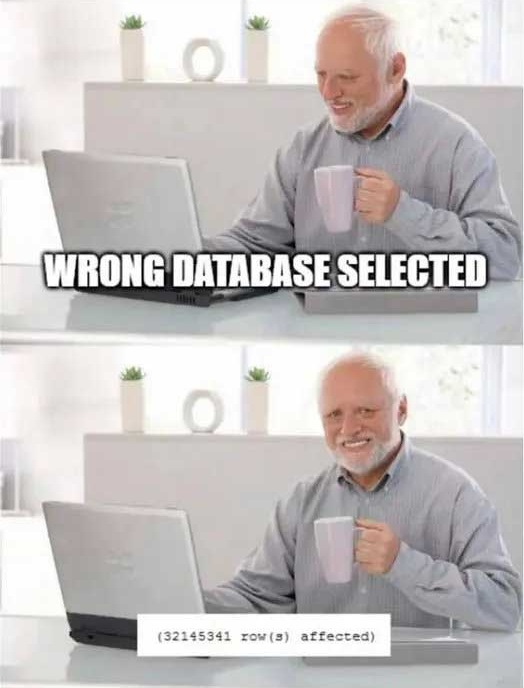

In my 7+ years of work, I encountered numerous situations when you need to store a boolean in the database to represent the state of a particular entity.  

Before we continue to important parts I will explain each type and when it’s usually used. I will refer to examples in the Postgres database.

## Boolean

The Boolean data type is a popular data type that accepts three values: ```true```, ```false```, and ```NULL```. The ```true``` value of the Boolean data can also be represented by the letters ```yes```, ```y```, ```true```, and ```1```. The ```false``` value of boolean datatype can also be represented by ```no```, ```n```, ```false```, and ```0```.

For example, if you have a blog and write a blog post but don't want to publish it right away, you can save it and publish it later. You can indicate whether or not your blog post has been published by setting the ```is_published``` attribute to ```true/false```. Your readers will only see published posts this way.

## Timestamp

There are two timestamp datatypes in the Postgres database:
- ```timestamp``` (a timestamp without timezone, for example ```2022-09-14 15:00:00```)
- ```timestamptz``` (timestamp plus timezone, for example ```2022-09-14 15:00:00+05:30```)

For the sake of simplicity, we will only discuss the timestamp type here.
The ```timestamp``` datatype can store both date and time. However, it lacks time zone information. This means that if you change your database server's timezone, the timestamp value stored in the database will not change automatically.

For example, if you want to store the date and time of the user's last login, you can use ```timestamp```, and when the user logs in, you can save it in the database in the ```last_login_date``` field.

Now that we've covered these two datatypes, let's look at three reasons why you should use ```timestamp``` instead of ```boolean``` in specific situations.



## 1. You want to know “when”

In my day-to-day work, there have been numerous occasions when I have saved a ```boolean``` and later wished I had a ```timestamp```. There have been zero occasions when I have regretted storing a ```timestamp```.

What is the reason for this? Because any time a piece of data is important enough to store its truth/falsehood in your database, you'll probably want to know when that state was set.

Here are some good examples:
- ```modified``` to ```modified_at```
- ```deleted``` to ```deleted_at```
- ```published``` to ```published_at```
- ```redeemed``` to ```redeemed_at```
- ```delivered``` to ```delivered_at```

In all of these examples, knowing WHEN is more valuable than simply knowing the status.

However, there are some situations in which you should keep a ```boolean```. These characteristics are almost used in a toggle switch fashion. Here are some examples:
- ```has_active_membership``` - you want to see if the user has an active gym membership
- ```is_physical_product``` - you want to store information if a product from the webshop is a physical product, for example to distinguish software licenses and keyboards that need to be stored in the warehouse.

## 2. The ergonomics are nearly the same

In terms of code ergonomics and flexibility, simply treat a ```NULL``` timestamp as ```false``` and any non-NULL timestamp as ```true```, and your ```boolean``` use-case is complete. Here's a JavaScript example:

```js
// using a boolean
const isPublished = true;
console.log(`It's ${isPublished ? true : false}!`);

// using a timestamp
const publishedAt = new Date();
console.log(`It's ${publishedAt ? true : false}!`);
```

The ergonomics are remarkably similar. You can also improve the appearance by using the ```isPublished()``` helper function, which checks the ```published_at``` attribute. I'm sure you already know the fundamentals!

## 3. Costs are negligible

In a Postgres database, a [boolean datatype](https://www.postgresql.org/docs/current/datatype-boolean.html) is stored in 1 byte, while the [timestamp datatype](https://www.postgresql.org/docs/current/datatype-datetime.html) is 8 bytes. 

If we gonna nitpick here, you need to be careful if you have a huge dataset, with a large number of timestamp attributes (that are indexed). In this case, you will save some storage if you opt for a boolean datatype instead of the timestamp. 

In most situations this is not the case, so you are good to go.

## Conclusion

- Consider storing a ```delivered_at``` timestamp instead of a ```delivered``` boolean.
- If you need a ```is_hidden``` attribute, try ```hidden_at``` instead. Allow that to sink in before asking yourself if you regret your choice.
- Or if you're about to create a ```boolean``` that indicates whether the coupon code has been redeemed with the ```isRedeemed``` attribute. You'll be curious as to when that occurred: ```redeemed_at``` to the rescue.

